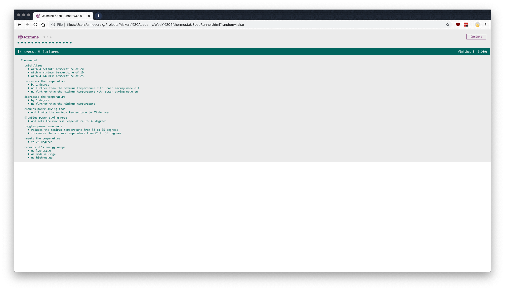

# Thermostat #
This is a simple thermostat web app built in JavaScript and uses Jasmine for unit tests. 

## Specification ##
* Thermostat starts at 20 degrees
* You can increase the temperature with an up function
* You can decrease the temperature with a down function
* The minimum temperature is 10 degrees
* If power saving mode is on, the maximum temperature is 25 degrees
* If power saving mode is off, the maximum temperature is 32 degrees
* Power saving mode is on by default
* You can reset the temperature to 20 with a reset function
* You can ask about the thermostat's current energy usage: < 18 is low-usage, < 25 is medium-usage, anything else is high-usage.
* (In the challenges where we add an interface, low-usage will be indicated with green, medium-usage indicated with black, high-usage indicated with red.)

## User Stories ##
```
As a user
So I can see the current temperature
I'd like the thermostat to start at 20 degrees

As a user
So I can change the temperature
I'd like to be able to increase the temperature with an up function

As a user
So I can change the temperature
I'd like to be able to decrease the temperature with a down function

As a user
So I don't get too cold
I'd like the minimum temperature to be 10 degrees

As a user
So I can save power
I'd like the maximum temperature to be 25 degrees when power saving mode is on

As a user
So I can save power
I'd like the maximum temperature to be 32 degrees when power saving mode is off

As a user
So I can save power
I'd like to have power saving mode turned on by default

As a user
So I can easily return to a normal temperature
I'd like to reset the temperature to 20 with a reset function

As a user
So I can quickly tell how much energy I am using
I'd like to ask the thermostat about it's current energy usage
```

## Installing and Running the App
1. clone this repository
```bash
git clone https://github.com/aimeecraig/thermostat.git
```
2. With [Bundler](https://bundler.io/) installed run `bundle install` to install dependencies
3. run `ruby app.rb` to start the app
4. Navigate to `http://localhost:4567` to interact with the app.
5. Controls for interacting with the app should all appear on screen
6. Jasmine tests can be run by opening the `SpecRunner.html` file



## Contributor
[Aimee Craig](https://github.com/aimeecraig/thermostat) and I paired on this challenge.
